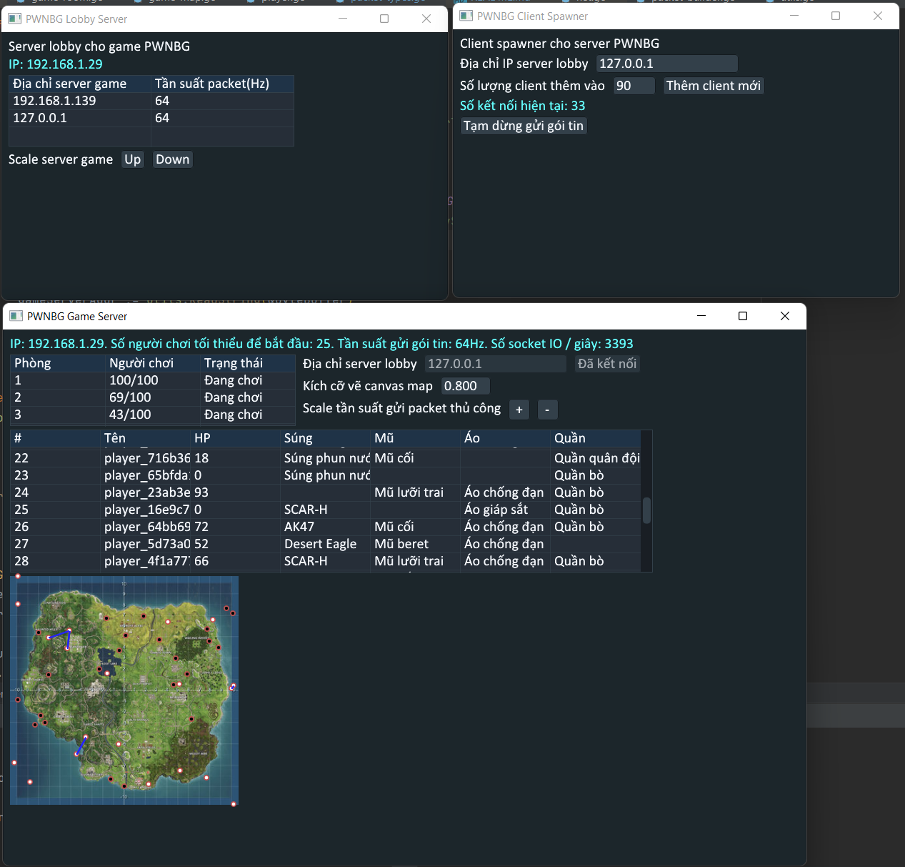

# Các tài liệu
- Slide thuyết trình: https://docs.google.com/presentation/d/1vHSztSNsZoYcw58dJthm12sMkQBbFvE5TPDn9emm3lI/edit?usp=sharing
- Doc mô tả: https://drive.google.com/file/d/1nD5BiTWYvl1jwTKewVxBRiU8wOjuSFPN/view?usp=sharing
- Video demo: https://drive.google.com/file/d/1xjUxMwpunkw_OBn5YKP3hOiKBuBGunU1/view?usp=sharing

# Lưu data

## Server lobby

> Một server duy nhất, chứa toàn bộ thông tin người dùng, và trỏ đến các server game, điều hướng người chơi vào server game

### Dữ liệu

- Database: map[username:string->Account]
  - Account:
    - Username: string
    - GameServerAddress: \*string (pointer = nullable)
    - SessionId: KCP Connection

- GameServerAddresses: string\[]
- Rooms: Room[]
  - Room:
    - CurrentPlayers: int
    - MaxPlayers: int
    - GameServerAddress: string
    - State: RoomState

### Cổng:

- 19000: Nghe server game
- 19001: Nghe client
- 19006: Nghe alert auto-scale

## Server game

> Nhiều server đặt ở các region khác nhau (mỗi region có thể nhiều server game -> thành cụm server game) để xử lý logic các phòng game

### Dữ liệu

- LobbyServerSession: KCPConnection
- Rooms: Room\[]
- Room:
  - Map: GameMap
  - GameMap:
    - Dữ liệu map (size, tile, ...)
    - Store là toàn bộ vật phẩm game (mũ, áo, quần, súng)
  - Players: map[username:string->Player]
    - Player
      - Session: KCP Connection
      - Dữ liệu người chơi trong game (vị trí, máu, vật phẩm hiện có,...)
- Players: map[username:string->*Room]

### Cổng:

-   19003: nghe client

# Giao thức game PWNBG (packet/UDP)

## Packet dạng chung (cho cả server lobby (SL), server game (SG) và client(C)):

-   **Byte 0:** Loại gói tin
-   **Byte 1:** Loại gói tin chi tiết hơn
-   **Các byte sau:** Thông tin chi tiết

## C khởi tạo kết nối tới SL (byte 0 = 1):

-   **Byte 1:** Loại gói tin

### C gửi lệnh đăng nhập

-   **Byte 1** = 1
-   **Byte 2+**: Tên người chơi (string)

### SL gửi lệnh đăng nhập thành công

-   **Byte 1** = 2

### SL gửi lệnh đăng nhập thất bại

-   **Byte 1** = 3

## SG khởi tạo kết nối với SL (byte 0 = 2):

-   **Byte 1:** Loại gói tin

### SG gửi lệnh muốn thêm vào SL

-   **Byte 1** = 1

-   **Byte 2-3**: Tần suất gửi gói tin có tần suất cố định của client/server (gói/giây) (bội số của 2, mặc định là 64)

### SL gửi thông báo xác nhận thành công

-   **Byte 1** = 2

### SL gửi thông báo xác nhận thất bại

-   **Byte 1** = 3

## SL gửi địa chỉ để C kết nối tới SG (byte 0 = 3):

-   **Byte 1:** Loại gói tin

### SL gửi địa chỉ SG gần nhất cho C

-   **Byte 1** = 1
-   **Byte 2+**: Địa chỉ SG. VD: "192.168.1.3"

### SL bắt C phải ngắt kết nối tới SG

-   **Byte 1** = 2

## SG trao đổi thông tin các phòng với SL (byte 0 = 4):

-   **Byte 1:** Loại gói tin

### SG gửi tình trạng của phòng (5s/lần)

- **Byte 1** = 1
- **Byte 2-3**: Tần suất gửi gói tin có tần suất cố định của client/server (gói/giây) (bội số của 2, mặc định là 64)
- Nhóm 5 byte từ byte số 4:
  - **Byte 0-1**: Số người chơi hiện tại
  - **Byte 2-3**: Số người chơi tối đa
  - **Byte 4**: Trạng thái game (0 = đang chờ, 1 = đang chơi, 2 = kết thúc)

## C kết nối tới SG (byte 0 = 5):

-   **Byte 1:** Loại gói tin

### C gửi thông báo muốn vào phòng

- **Byte 1:** = 1
- **Byte 2+:** Tên đăng nhập

### SG gửi thông báo xác nhận thành công, và dữ liệu trạng thái game hiện tại

- **Byte 1** = 2
- **Byte 2** = 1 nếu gói tin có kèm dữ liệu hiện tại, 0 nếu không gửi, và bỏ qua byte 3+
- **Byte 3-4:** Toạ độ x hiện tại của người chơi
- **Byte 5-6:** Toạ độ y hiện tại của người chơi
- **Byte 7-8:** Máu hiện tại của người chơi
- **Byte 9-10:** ID súng đang trang bị của người chơi
- **Byte 11-12:** ID mũ đang trang bị của người chơi
- **Byte 13-14:** ID áo đang trang bị của người chơi
- **Byte 15-16:** ID quần đang trang bị của người chơi
- **Byte 17-18:** Tần suất gửi gói tin của phòng (để phục vụ autoscaling)
- **Byte 19:** Trạng thái hiện tại của phòng  (0 = chưa bắt đầu, 1 = đang chơi, 2 = đã kết thúc)
- **Byte 20-21:** Chiều dài bản đồ
- **Byte 22-23:** Chiều rộng bản đồ
- **Các byte sau:** //TODO Tính sau

### SG gửi thông báo xác nhận thất bại

-   **Byte 1** = 3

## Trong game (byte 0 = 6):

-   **Byte 1:** Loại cập nhật trong game
-   **Các byte sau:** Thông tin chi tiết

### C: Cập nhật vị trí người chơi

-   **Byte 1** = 1
-   **Byte 2-3:** Toạ độ x
-   **Byte 4-5:** Toạ độ y

### SG: Cập nhật item (trang bị mới nhặt được) của người chơi

-   **Byte 1** = 2
-   **Byte 2-3:** ID item

### SG: Cập nhật máu người chơi

- **Byte 1** = 3
- **Byte 2-3:** Máu hiện tại

### SG: Cập nhật trạng thái trò chơi

- **Byte 1** = 4
- **Byte 2:** Các trạng thái (0 = chưa bắt đầu, 1 = đang chơi, 2 = đã kết thúc)

### SG: Thay đổi tần suất gửi gói tin

- **Byte 1** = 5
- **Byte 2-3:** Tần suất gửi (Hz)

## SG gửi thông báo scale up/down (byte 0 = 7):
- **Byte 1:** Loại cập nhật trong game

### SG yêu cầu SC scale up
- **Byte 1** = 1

### SG yêu cầu SC scale down
- **Byte 1** = 2

# Giao thức game PWNBG (JSON/http)

## Endpoint `/`
>2 loại alert scale
- `{"alert":"scale-up"}`
- `{"alert":"scale-down"}`
